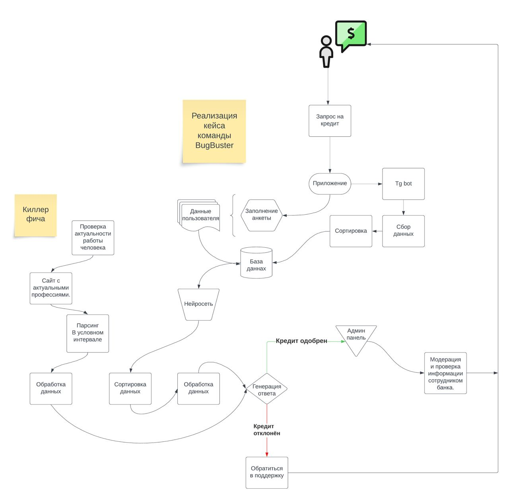

Реализованная функциональность
Функция Реального Времени: Анализ Важных Профессий

1) Пользователь вводит свои данные
2) Данные передаются в нейросеть
3) Нейросеть обрабатывает введенные данные
4) Выводит есть ли возможность у человека получить кредит или нет
5) Данные сохраняются и передаются в админ-панель сотруднику банка

Наши инновационные технологии позволяют проводить анализ значимости текущей профессии в режиме реального времени при рассмотрении заявки на кредит. Это означает, что мы учитываем актуальные рыночные тренды и потребности, повышая шансы на одобрение кредита для тех, кто занят в важных и востребованных отраслях. Такой подход способствует более справедливой и гибкой системе кредитования, стимулируя финансовую поддержку для профессионалов, играющих ключевую роль в экономике.

Особенность проекта в следующем:

Понятный пользователям интерфейс и доступность сервиса на всех платформах, нашими киллерфичами является глубокий анализ нейросетью введенной пользователем профессии и присвоение этой профессии оценки, благодаря чему повышается точность оценки кредитоспособности человека.

Дополнительная реализация в будущем:

Так же в наших приложениях будут перспективно присутствуетвовать возможность смены язык на английский, а так же смена темы с светлой на темную что, в свою очередь, поможет привлечь новых пользователей на сервис.

 
Основной стек технологий:
 
Machine learning, AI
 
HTML, CSS
 
PHP 8, MySQL
 
Python
 
Laravel
 
Git, Mercurial
 
Github

Демо сервиса доступно только при локальном запуске (Laravel, python)

 
СРЕДА ЗАПУСКА
 
требуется установленный web-сервер с поддержкой PHP(версия 8.1+);

google colab для заупска нейроной сети 
 
УСТАНОВКА
 
Для запуска Laravel
Установка пакета composer
Выполните

composer install
composer update

 
БАЗА ДАННЫХ

Подключение к базе прописать в конфигурационный файл сервиса: .env
Пустая база данных создается и импортируется автоматически:
php artisan migrate
php artisan migrate:fresh

 
Установка зависимостей проекта
Для python:

pip install telebot
 
pip install tensorflow==2.14.0
 
pip install keras
 
pip install pandas
 
pip install sklearn
 
pip install numpy
 
pip install sqlite3
 
pip install pickle

Установка зависимостей осуществляется с помощью Composer. Если у вас его нет вы можете установить его по инструкции на getcomposer.org.

После этого выполнить команду в директории проекта для запуска Laravel проекта на локальном сервере:

php artisan serve

РАЗРАБОТЧИКИ
Бабков Мирослав Витальевич
Пугаченко Максим Романгович
Золотарев Даниил Романович
Лушников Дмитрий Анатольевич
Домашенко Иван Александрович